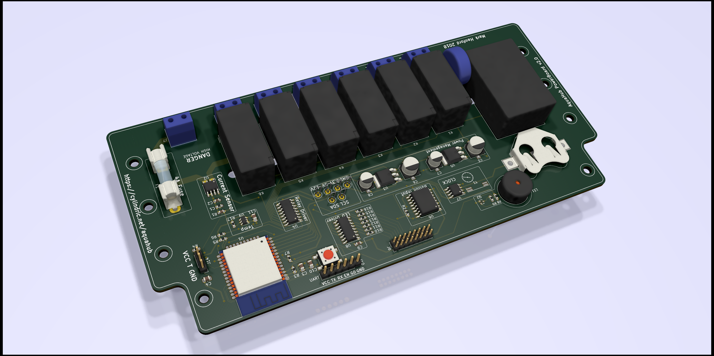

# AquaHub

# Key Components

## Hardware

The electronic designs are all made using [KiCad](http://kicad-pcb.org).

The actual KiCad project files are [here](Hardware/AquaHub/).

Rendered output (schematic and board PDFs, gerbers and bom) are [here](Hardware/Output/). (Not always up-to-date with the schematics and boards, so use with caution)

### License

All hardware designs are licensed under the [CERN Open Hardware Licence v1.2](https://www.ohwr.org/licenses/cern-ohl/license_versions/v1.2).

Myriam Ayass, legal adviser of the Knowledge and Technology Transfer Group at CERN and author of the CERN OHL:

> In the spirit of knowledge sharing and dissemination, the CERN Open Hardware Licence (CERN OHL) governs the use, copying, modification and distribution of hardware design documentation, and the manufacture and distribution of products.
> 
> The CERN–OHL is to hardware what the General Public Licence (GPL) is to software. It defines the conditions under which a licensee will be able to use or modify the licensed material. The concept of ‘open-source hardware’ or ‘open hardware’ is not yet as well known or widespread as the free software or open-source software concept. However, it shares the same principles: anyone should be able to see the source (the design documentation in case of hardware), study it, modify it and share it.
> 
> In addition, if modifications are made and distributed, it must be under the same licence conditions – this is the ‘persistent’ nature of the licence, which ensures that the whole community will continue benefiting from improvements, in the sense that everyone will in turn be able to make modifications to these improvements.

### Rev 1
- [x] ESP32 module for control and wireless access (Espressif ESP32-WROOM-32D)
- [x] Current Sensing for consumption reporting and equipment failure detection (Melexis MLX91210KDC)
- [x] RTC for power-loss schedule persistence (Maxim DS1307Z)
- [x] Temperature monitoring (DS18B20)
- [x] Audible alarm
- [x] Six switchable mains-level outputs (Fujitsu FTR-F1A)
- [x] Direct mains-powered (Recom RAC04-12SGB)

### Rev 2
- [ ] PCB: selectable low-level power select, for testing from a 12V supply instead of 240V
- [ ] PCB: additional sensor for ambient temperature (on-board or external?)
- [ ] PCB: additional input for flow-rate sensor
- [ ] PCB: additional input for pH sensor (might not be feasible without a permanent-immersion sensor?)

## Software

### License

All software (firmware) are licensed under the [GNU General Public License v3.0](https://www.gnu.org/licenses/gpl-3.0.en.html).

[In summary](https://tldrlegal.com/license/gnu-general-public-license-v3-(gpl-3)):
> You may copy, distribute and modify the software as long as you track changes/dates in source files. Any modifications to or software including (via compiler) GPL-licensed code must also be made available under the GPL along with build & install instructions.

### Rev 1
- [ ] Over-the-air firmware updates
- [ ] Web UI
- [ ] Task Scheduler
- [ ] Temperature-based control
- [ ] Temperature alarm
- [ ] Pump-fail alarm
- [ ] WiFi config

# Hardware Build

A Mouser project with some of the components listed in detail is available here: [AquaHub At Mouser](https://www.mouser.com/ProjectManager/ProjectDetail.aspx?AccessID=329311b4a5). Not always updated with the current BOM from the schematic, and parts change so may be unavailable. CHECK THE SCHEMATIC.

## Datasheets

[Espressif ESP32 WROOM 32D](https://www.espressif.com/sites/default/files/documentation/esp32-wroom-32d_esp32-wroom-32u_datasheet_en.pdf)
[Recom 5v Regulator](https://www.recom-power.com/pdf/Innoline/R-78Exx-0.5.pdf)
[Diodes 3.3V Regulator](http://www.diodes.com/datasheets/AP1117.pdf)
[2SC1815 Transistor](https://media.digikey.com/pdf/Data%20Sheets/Toshiba%20PDFs/2SC1815.pdf)
[Maxim I²C RTC](https://datasheets.maximintegrated.com/en/ds/DS1307.pdf)
[TI I²C IO Expander](http://www.ti.com/lit/ds/symlink/tca9534.pdf)
[TI I²C LED Driver](http://www.ti.com/lit/ds/symlink/tpic2810.pdf)

## References

DS18B20 temperature - [ESP32 With Multiple DS18B20 Sensors](https://randomnerdtutorials.com/esp32-with-multiple-ds18b20-temperature-sensors/)
